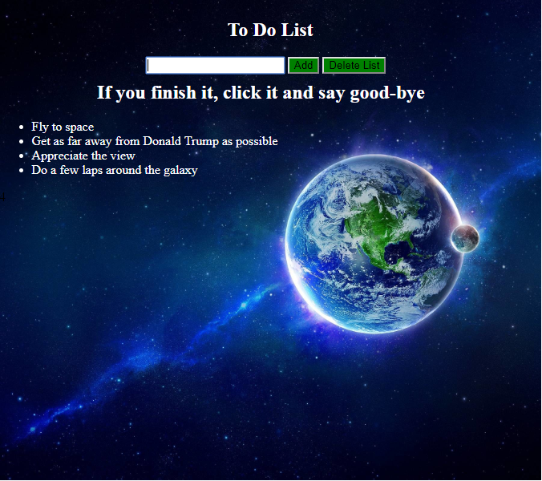

# My Awesome To Do List
A web application to do list made with HTML CSS and JQuery.

## How It's Made:

**Tech used:** HTML, CSS, JQuery

This web application was made using JQuery for functionality. Users are able to input and add things into the to do list and at the push of a button display those things. Users are also able to click on individual items when completed in order to delete them off the list as well as click a button to clear the entire list and create another.

## Lessons Learned:

During the construction of this web application I learned how to give an li the Id of a constantly changing variable so that each time a new li was appended, it was in fact independently added to the unordered list.
